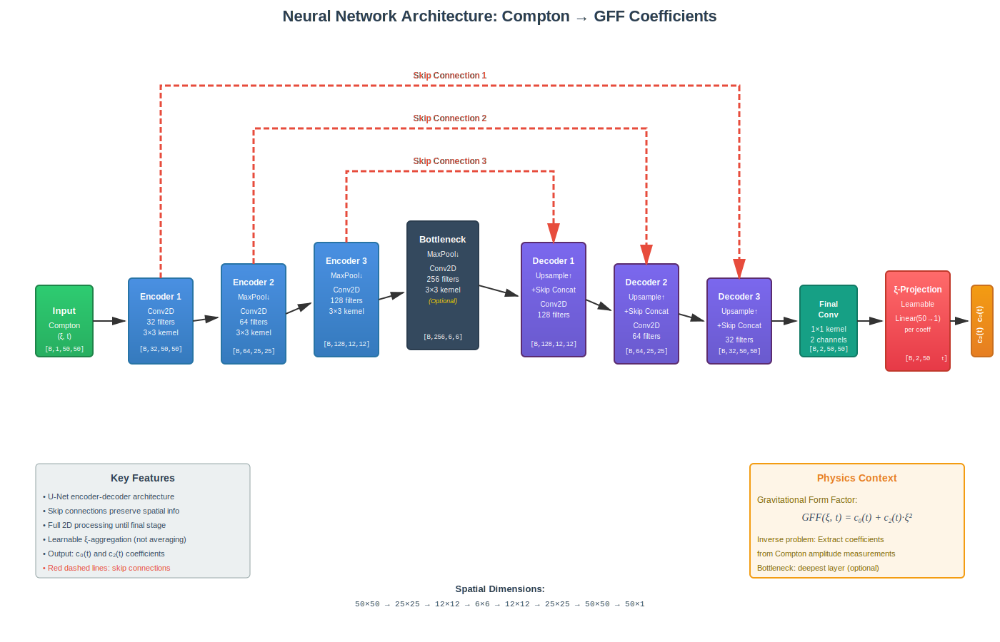

# X_to_GFF_tests

The final goal is to extract GFFs from cross sections. As the first step, we test on Compton Form Factors instead of the cross section.
For the vector CFFs (from GPDs $H^q$ and $E^q$):

$$\mathcal{H}(\xi, t) = \sum_q e_q^2 \int_{-1}^1 dx  H_g(x, \xi, t) \left[ \frac{1}{x - \xi + i\epsilon} - \frac{1}{x + \xi - i\epsilon} \right],$$

$$\mathcal{E}(\xi, t) = \sum_q e_q^2 \int_{-1}^1 dx  E_g(x, \xi, t) \left[ \frac{1}{x - \xi + i\epsilon} - \frac{1}{x + \xi - i\epsilon} \right].$$

and the corresponding GFFs are, 

$$A_{g}(\xi,t) = \int_{0}^{1} dx  H_g^{DD}(x,\xi,t)$$ 

$$D_{g}(\xi,t) = \frac{1}{\xi^2} \int_{0}^{1} dx  |\xi| \cdot D_g(x,\xi,t)$$

where we have,

$$
H_g(x,\xi,t) = H_g^{DD}(x,\xi,t) + |\xi| \cdot D_g(x,\xi,t)
$$

$$
E_g(x,\xi,t) = -|\xi| \cdot D_g(x,\xi,t)
$$

## Compton Form Factors to GFF

1, *Images lives on 2-d lattice*: Both $\mathcal{H}/\mathcal{E}(\xi, t)$, and $A/D_{g}(\xi,t)$ lives on the $\xi-t$ lattice, where $\xi$ is a function of energy. We are currently setting $N=50$.

2, *GFFs only depends on t*: Both $A_{g}(t)$, and $D_{g}(t)$ only depends on t. So our output is 2 by 50, while input is 50 by 50 lattice.

3, *Mask for missing value*: we should be able to handle missing value in some part of the phase space on the Compton Form Factor side but GFFs has no missing value because they are entirely from reconstruction. There are multiple approach to experiment with.

## Handle missing data points

1, *We start with no missing data points*: This is to avoid using Graphic neural network, which is more expensive when it comes to computational resources.

2, *Naively, we fill the missing phase space with zeros*: add an extra binary channel to indicate where there are missing data. But we can also randomly choose some part of the phase space and fill it with zero so the network will learn that zero might not mean Xsection is zero.

3, *Partial convolution*: Convolution operation that ignores masked regions. This can be tested on model generated data.

## To-Do List

- [ ] Data generation
- [ ] Training without missing value
- [ ] Training with missing value
